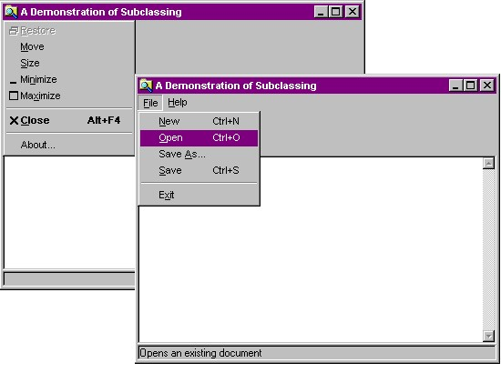



## Subclassing

### Description

Subclassing, the interception of Windows messages, allows you more control over VB than ever before. Now you can display messages in the status bar describing a menu that is selected, or force a form to have a maximum and minimum size (like the VB main window). This code shows the benefits of subclassing.
 
### More Info
 
Just add the two modules and class to your project and code away!

Subclassing is potentially dangerous. Read the text file accompanying this code for more details.

             |
---                |---
**Submitted On**   |2000-07-05 16:54:04
**By**             |[Steve Weller](https://github.com/Planet-Source-Code/PSCIndex/blob/master/ByAuthor/steve-weller.md)
**Level**          |Intermediate
**User Rating**    |4.0 (32 globes from 8 users)
**Compatibility**  |VB 3\.0, VB 4\.0 \(16\-bit\), VB 4\.0 \(32\-bit\), VB 5\.0, VB 6\.0, VB Script, ASP \(Active Server Pages\) 
**Category**       |[Windows API Call/ Explanation](https://github.com/Planet-Source-Code/PSCIndex/blob/master/ByCategory/windows-api-call-explanation__1-39.md)
**World**          |[Visual Basic](https://github.com/Planet-Source-Code/PSCIndex/blob/master/ByWorld/visual-basic.md)
**Archive File**   |[CODE\_UPLOAD7463752000\.zip](https://github.com/Planet-Source-Code/steve-weller-subclassing__1-9532/archive/master.zip)

